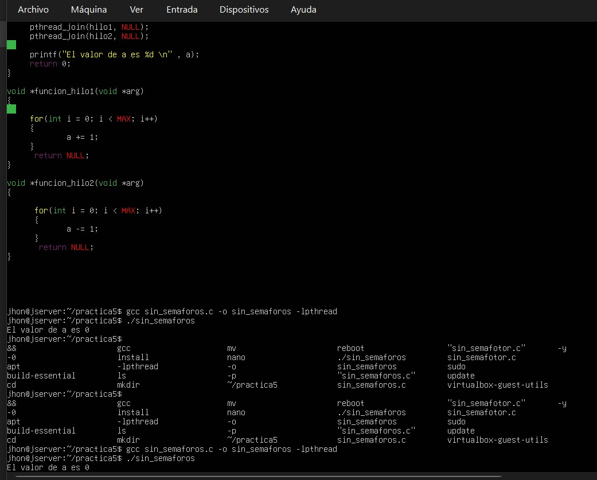
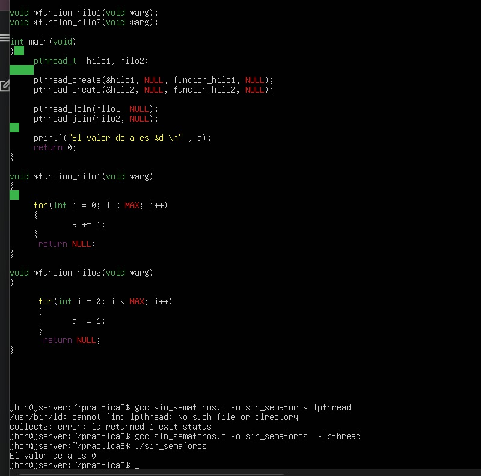
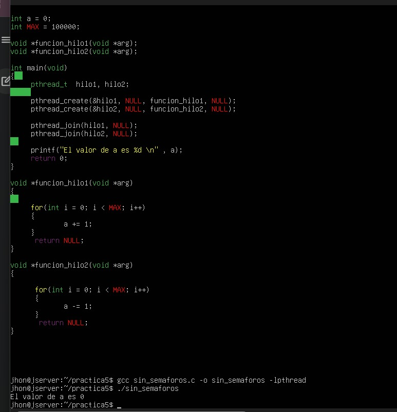
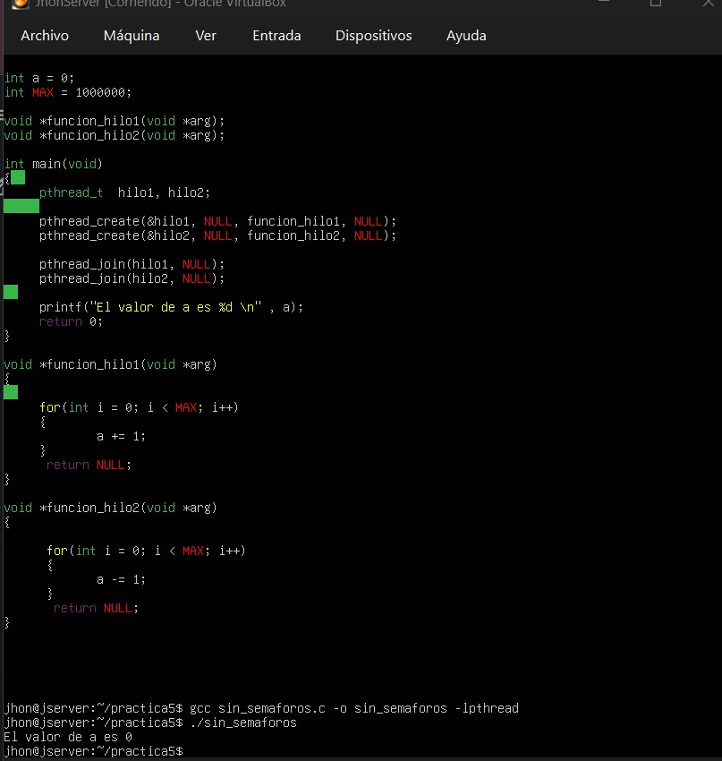

# Ejercicio 3.1 - Concurrencia de Hilos sin Sincronización

Este módulo contiene la implementación del primer escenario de la práctica, diseñado para analizar el comportamiento de dos hilos concurrentes que acceden y modifican una variable global compartida (`int a`) en ausencia de mecanismos de exclusión mutua.

## Metodología de Pruebas y Resultados de la Tabla 1

Con el fin de observar cómo afecta el volumen de iteraciones a la ejecución, la variable `MAX` fue modificada y evaluada en diferentes escalas durante las pruebas locales en el servidor. A continuación, se detalla el comportamiento e impacto de cada ejecución:

### 1. Prueba con MAX = 1000
Al ejecutar el programa con un límite bajo, los hilos completan sus ciclos de forma casi instantánea. El tiempo de CPU otorgado es más que suficiente para procesar las iteraciones de corrido.
* **Resultado impreso:** `El valor de a es 0`
* **Evidencia:**


### 2. Prueba con MAX = 10000
Al incrementar el límite a diez mil, las operaciones aritméticas simples se resuelven en microsegundos, manteniendo un comportamiento lineal debido a la alta velocidad de procesamiento de la máquina.
* **Resultado impreso:** `El valor de a es 0`
* **Evidencia:**


### 3. Prueba con MAX = 100000
A pesar de aumentar la carga a cien mil iteraciones, el planificador del núcleo de Linux mantiene las ráfagas completas para cada hilo, evitando pérdidas de sincronización intermedia.
* **Resultado impreso:** `El valor de a es 0`
* **Evidencia:**


### 4. Prueba con MAX = 1000000
Incluso bajo una carga masiva de un millón de iteraciones de suma y resta directas, los hilos agotan su ciclo entero antes de que el sistema operativo se vea forzado a realizar un cambio de contexto.
* **Resultado impreso:** `El valor de a es 0`
* **Evidencia:**


---

## Análisis Técnico: ¿Por qué el resultado siempre retorna a cero?

El hecho de que el valor final regrese a `0` de forma constante en todas las escalas de prueba se justifica técnicamente bajo los siguientes conceptos de sistemas operativos:

* **Simplicidad de las instrucciones:** Las operaciones `a += 1` y `a -= 1` consumen recursos mínimos a nivel de instrucciones de máquina, ejecutándose sumamente rápido en el procesador.
* **Ejecución secuencial por ráfagas:** El planificador de procesos del sistema operativo (*Kernel Scheduler*) asigna un tiempo de CPU (*quantum*) que resulta suficiente para que el primer hilo inicie, cuente el total de iteraciones de golpe y finalice.
* **Ausencia de intercalación:** Al no cruzarse las lecturas y escrituras de memoria RAM en el mismo instante, los flujos operan de forma consecutiva. El primer hilo termina de sumar el valor de `MAX` y luego el segundo resta exactamente la misma cantidad. Ambos efectos aritméticos se anulan limpiamente ($+MAX - MAX = 0$), manteniendo la integridad del balance final en cero.

---

## Instrucciones de Compilación y Ejecución

Para correr este ejercicio en Ubuntu Server:

```bash
gcc sin_semaforos.c -o sin_semaforos -lpthread
./sin_semaforos

